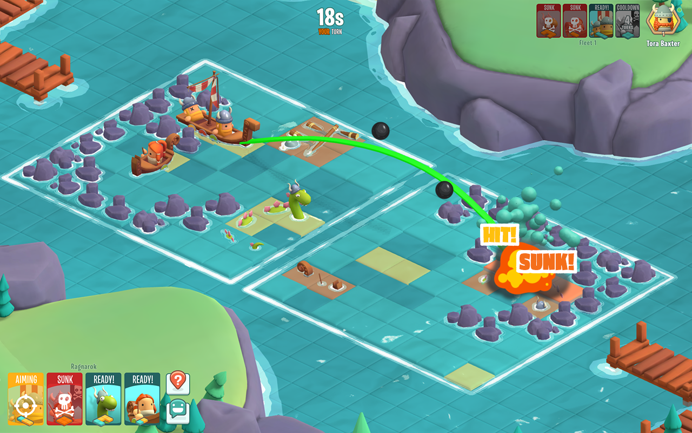
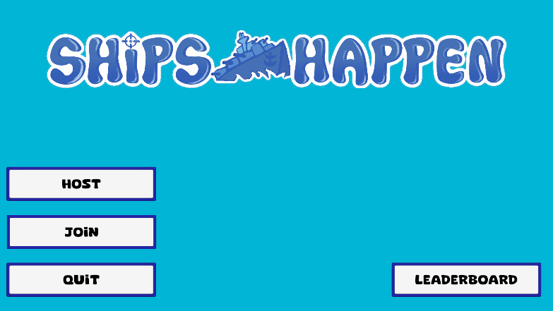
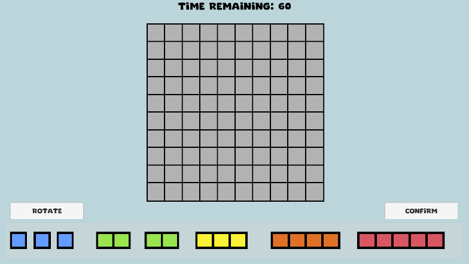
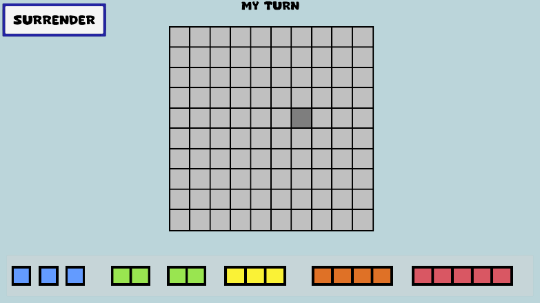
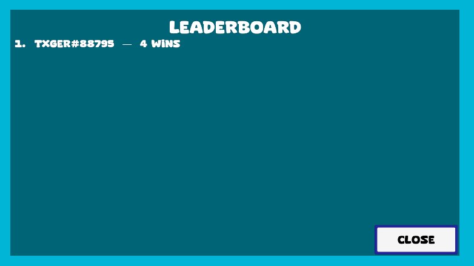
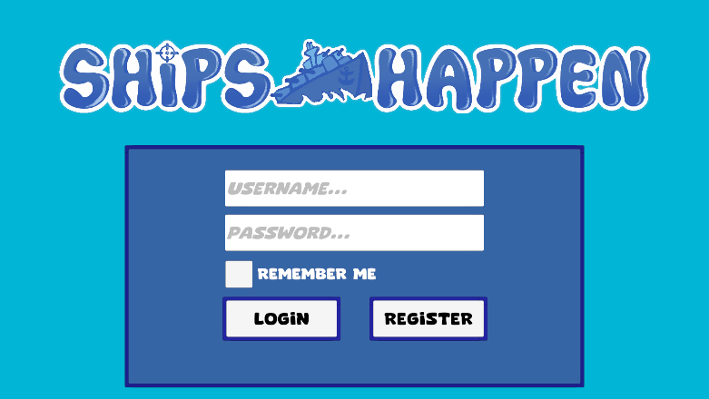
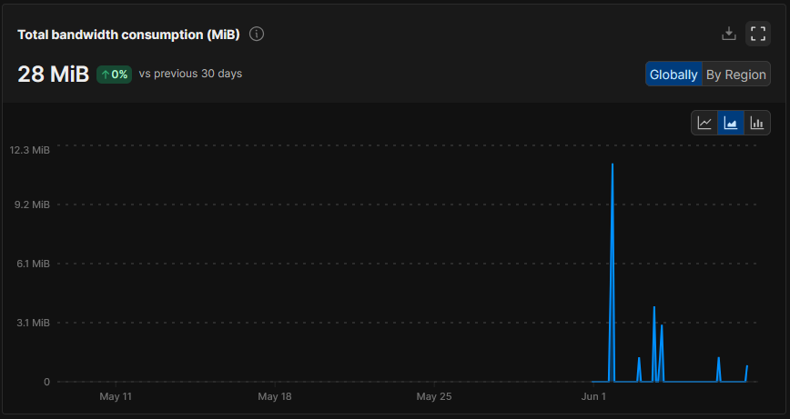
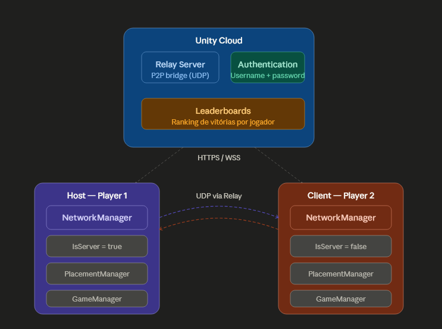

# Relatório - Sistema de Redes para Jogos

### Tema: ShipsHappen (Batalha Naval)

_Simão Campaniço a22510616_

---

### Descrição do Projeto

Jogo de batalha naval online. Dois jogadores conectam-se através de um código de sala, colocam os seus barcos numa grelha 10x10 e, alternando turnos, tentam adivinhar e destruir os barcos do adversário. O jogo conta com autenticação de utilizadores e uma leaderboard global.

---

### Link para o Projeto

- **GitHub (Source):** https://github.com/SimaoCampanicoDev/ShipsHappen

- **Google Drive (Builds):** https://drive.google.com/drive/folders/1GcfbajwIqXvN2stjp7FOmsaEak74-Exf?usp=sharing

#### Instruções

1. Ambos os jogadores abrem o executável (ou um usa o Editor e o outro o executável)
2. Fazem login ou registam uma conta na **LoginScene**
3. Um jogador clica **Host** e aparece um código de sala
4. O segundo jogador clica **Join** e introduz o código
5. Ambos são enviados para a **PlacementScene** automaticamente
6. Depois de inserirem todos os barcos e clicarem em confirm, são enviados para a **GameScene** onde podem começar, por turnos, a adivinhar os barcos de cada um.

---

### Timeline

### 18/05/2026

A procurar uma ideia para o jogo, joguei um jogo chamado BattleTabs (https://discord.com/application-directory/battletabs), um jogo de batalha naval que está disponível no Discord. Gostei do conceito e comecei a fazer a pesquisa, onde procurei logo por uma imagem de referência para o layout da grelha, até porque eu não sabia sequer o tamanho da mesma, até encontrar a imagem que me ajudou (https://www.digitall.vodafone.pt/wp-content/uploads/2021/07/DA024L1.1-1024x576.jpg). Após isso, comecei por usar o Unity Netcode (https://youtu.be/3yuBOB3VrCk?si=NB_LHXBzdzy4IMHV) e o Unity Relay (https://youtu.be/msPNJ2cxWfw?si=fpNF54Y6aT4eOamT), e ao mesmo tempo que procurava pelos dois encontrei um vídeo que juntava os dois, tanto a programação de um jogo de batalha naval 2D como a parte de fazer um jogo Online no Unity. Tutorial parte 1 (https://www.youtube.com/watch?v=s3ZrQbI5o_k) e parte 2 (https://youtu.be/3Fw-NiZ3HGg?si=J4osvecTw9GkBtOQ). O link do github da minha inspiração para a client side do jogo (https://github.com/mobyjames/naval-battle-client).

### 28/05/2026

Criação do projeto Unity com `.gitignore` e `README.md` e conectando o projeto ao GitHub.

### 31/05/2026

Instalação dos packages necessários:

- Netcode for GameObjects
- Unity Transport
- Multiplayer Services
- Authentication

Criação do `LobbyManager.cs` com base no `NetworkSetup.cs` do projeto do professor. Implementação dos botões Host e Join com comunicação usando o Unity Relay (ativado no https://cloud.unity.com/). Testes ao MainMenu para, quando houver 2 pessoas na sala mudar para a `GameScene`.

### 01/06/2026

Adicionei o package ParrelSync para poder testar a parte multiplayer localmente (faz clone do projeto instantâneamnete e dá para testar com os dois editores ao mesmo tempo). Primeiro teste a funcionar onde: O Host cria sala, o Client entra com código, ambos são enviados para a `PlacementScene`. Resolvi um problema de merge conflicts no ficheiro `PlacementScene.unity` que aconteceram porque eu fiz alterações no portátil e esqueci-me de dar pull quando fui para o PC, fazendo com que fosse necessários editar o ficheiro manualmente para conseguir dar merge.

### 02/06/2026

Início da `PlacementScene`, que foi feito a grelha 10x10 usando um `GridLayoutGroup` conectado ao script `GridManager.cs`, um script `ShipDragger.cs` que implementa `IBeginDragHandler`, `IDragHandler` e `IEndDragHandler` para arrastar os barcos para a grid, a rotação dos barcos mudando o `sizeDelta` deles e a deteção das colisões entre os barcos usando um array para quando o local está ocupado. Tive alguns problemas inicialmente onde os barcos desapareciam quando eu arrastava, eu mudei e em vez de usar `transform.position = e.position` mudei para `RectTransformUtility`, problema na `Camera.main` que ficava null quando era Screen Space Overlay e criei um parent `ShipsOnGrid` com todos os barcos que estavam posicionados.

### 03/06/2026

Continuei a trabalhar no `ShipDragger.cs` e fiz com que o snap na grid fosse baseado no lado esquerdo do barco, fiz com que a rotação memorizasse sempre a posição horizontal original para que depois de rodar a primeira vez ele voltasse a rodar para a posição anterior, criei o `TryFindValidRotation` para procurar por uma posição para rodar tendo em atenção a colisão com os outros barcos e os limites da grid. Criei um botão de Confirm que, ao ser clicado, desaparece e faz com que não se possa mais dar rotate e drag dos barcos. Fiz uma transição de teste para quando os dois jogadores confirmar serem enviados para a `GameScene`.
Na `GameScene` criei um `GameManager.cs` que controla os turnos com `NetworkVariable currentTurn`, um `AttackGridManager.cs` e `DefenseGridManager.cs` para as duas grelhas, uma delas mostra o estado da tua grid quando estás a ser atacado e a outra que mostra onde já atacaste o adversário. O script `AttackCell.cs` com `Button.onClick` ligado para detetar os cliques nas células de ataque (inicialmente a grid de defesa estava a ficar invisível encima da grid de ataque, fazendo com que não fosse possível clicar nas células, algo que foi corrigido a desabilitar alternadamente as grids). Criei uns markers para que fosse fácil entender os diferentes cliques, ou seja: verde (hit), vermelho (miss), roxo (enemy hit), preto (enemy miss). Quando estava a fazer testes descobri que estava a dar para clicar em mais que um botão, então adicionei uma variable `isWaitingResult` para bloquear os clicks depois que clica uma vez. Ao jogar batakha naval no Roblox, descobri que durante o jogo aparecia os barcos que o jogador tem e, cada vez que um barco é eliminado, ele desaparecia para ser fácil saber qual barco foi eliminado. Com essa ideia, criei um `ShipStatusPanel.cs` que tem um `RegisterShipsExact` que regista a posição dos barcos individualmente e faz eles desaparecer quando são eliminados. Com isso, tive que criar o script `GameData.cs` que não é destruído no load que faz passar os dados do posicionamento no `PlacementScene` para o `GameScene`.
Criei um script para mudar cada jogador para uma scene de Loss e Victory (`VictoryScene` e `LossScene`) com o `ResultSceneController.cs` e cada scene tinha um botão para voltar para o `MainMenu`. Inicialmente ao voltar não estava a dar para criar uma sala novamente, então eu fiz com que sempre que entra no `MainMenu` o `(NetworkManager.Singleton.gameObject)` é destruído e cria um novo.

### 04/06/2026

Comecei a implementar a Leaderboard usando o Unity Leaderboards Service no https://cloud.unity.com/. Criei no site a leaderboard com o ID `wins_leaderboard` e fiz elas serem registradas usando o `AnalyticsManager.cs` incrementado cada vez que ganha um jogo e sendo registado na Dashboard com o Latest Score. Criei um UI no `MainMenu` com um botão que abre um painel, e nesse painel ele mostra o top de jogadores, usando o script `LeaderboardUI.cs`.

### 05/06/2026

Trabalhei no Login, depois de pesquisar ao claude qual era a melhor maneira de fazer um sistema de login usando o Unity e ele disse-me sobre o Unity Authentication e para usar o provider de Username + Password, que é o mais simples.Comecei por criar uma `LoginScene` e mudei ela para ser a primeira scene na build e criei um `LoginManager.cs` que faz tanto o register como o login do jogo, adicionando também feedback visual com um texto quando o jogador falha a senha, mete uma senha sem os requisitos (8-30 caracteres, maiúscula, minúscula, número, símbolo), etc. Fui à procura de imagens de Login de jogos para ter uma base de como fazer o UI simples e vi que era bastante comum usar um botão de Remember Me, então adicionei um toggle e, quando é ativado ele guarda nas `PlayerPrefs` e faz com que o login seja automático quando o jogador volta a abrir o jogo. O username do jogador também é guardado como `PlayerName` para que possa aparecer depois na leaderboard, que foi precisa ser alterada porque a autenticação estava a ser anónima (baseado no projeto do professor).

### 06/06/2026

Usei o dia de hoje para fazer correções, principalmente no `LobbyManager` que não parava a coroutine do host quando o jogador clicava Back para voltar para o `MainMenu`, fiz o NetworkManager ser instanciado usando um prefab no `LobbyManager` também para garantir que cada sessão muda depois de cada jogo, corrigi um problema com as posições individuais dos barcos não estarem a passar entre as scenes, e por isso os barcos no UI não estavam a desaparecer, adicionei o `GameData.MyShipCellGroups` que guarda as mesmas e fiz com que o `hitCounts` seja separado por jogador e que cada um tivesse uma contagem independente, porque o que estava a acontecer era que só havia uma variável de `hitCounts` então cada barco destruído contava para os dois.

---

### Análise de banda larga

---

### Diagrama de arquitectura de redes

---

### Agradecimentos

Quero agradecer especialmente à Cátia Nascimento, minha colega de turma que fez o logo do jogo e ao Dário e à Luana, meu amigos de longa data por terem disponibilizado o seu tempo para poder testar o jogo comigo. Mesmo sem necessidade nenhuma sempre estiveram presentes e se o projeto está funcional e como eu gosto é muito graças a eles por terem perdido tempo da sua vida para testar o jogo comigo e a procurar erros comigo. O seu esforço também deveria ser relembrado e por isso quis criar esta secção dedicada a eles.

---

### Bibliografia

#### Referências

- **BattleTabs:** https://battletabs.io/
- **Imagem de referência:** https://www.digitall.vodafone.pt/wp-content/uploads/2021/07/DA024L1.1-1024x576.jpg
- **Naval Battle Client:** https://github.com/mobyjames/naval-battle-client
- **Unity Netcode:** https://youtu.be/3yuBOB3VrCk?si=NB_LHXBzdzy4IMHV
- **Unity Relay:** https://youtu.be/msPNJ2cxWfw?si=fpNF54Y6aT4eOamT
- **Unity Netcode for GameObjects:** https://youtu.be/3yuBOB3VrCk?si=vsZ6mXVzs1tbPs82
- **Unity Authentication:** https://youtu.be/oqi9xsJZb5A?si=m5u11dccp9-6UrM0
- **Unity Leaderboards:** https://youtu.be/74b-R6dZKBw?si=u_eAwojaEgXZQoLg
- **IBeginDragHandler, IDragHandler, IEndDragHandler:** https://docs.unity3d.com/ScriptReference/EventSystems.IDragHandler.html
- **LayoutRebuilder:** https://docs.unity3d.com/ScriptReference/UI.LayoutRebuilder.html
- **ServerRpc e ClientRpc** https://www.youtube.com/watch?v=jXyxF42kZ_s
- **PlayerPrefs:** https://docs.unity3d.com/ScriptReference/PlayerPrefs.html
- **ParrelSync:** https://github.com/VeriorPies/ParrelSync
